# Shareholding Pattern (SHP) Viewer

## Context
The Shareholding Pattern Viewer is a dedicated React application designed to parse, aggregate, and visualize Indian corporate shareholding data. Company secretaries submit their Shareholding Pattern via official MCA (Ministry of Corporate Affairs) Excel utilities which get converted to XBRL (XML/JSON). The raw data is highly structured, and often, direct extraction leads to data overlap (e.g., percentages exceeding 100%) due to parent-child tag duplication.

## Goals
- Provide a clear, definitive "Source of Truth" mapping from complex XBRL tags to a simplified 6-bucket UI structure.
- Parse raw XBRL JSONs correctly grouping entities via their `contextref`.
- Display a dynamic, tabular UI to explore shareholding across various companies and reporting quarters.
- Guarantee that top-level percentage groupings sum strictly to 100%.

## Non-Goals
- Editing or submitting new XBRL files back to the exchanges.
- Extracting data from PDF/HTML documents (relies entirely on structured XBRL JSON/XML).
- Advanced analytical charting (focus is on a structured, expandable tabular view).

## How to Navigate and Use
1.  **Select a Company**: Use the dropdown to choose from the available companies in the `Examples` directory.
2.  **Select a Quarter**: Choose the corresponding reporting quarter.
3.  **Explore the Table**: The table displays 6 root rows. Click on any row to expand it and view the specific constituent shareholders grouped correctly by their `contextref`.

## The 6 Shareholding Categories

This application maps raw XBRL tags into six distinct, mutually exclusive top-level categories. Here is the conceptual mapping hierarchy:

```mermaid
graph TD
    Root[Total Shareholding 100%]
    Root --> P[Promoters]
    Root --> FI[Foreign Institutions]
    Root --> DI[Domestic Institutions]
    Root --> RI[Retail Individuals]
    Root --> GOV[Government]
    Root --> O[Others]

    P --> P1[Promoter Individuals / Hindu Undivided Family]
    P --> P2[Promoter Corporate Bodies]
    
    FI --> FI1[Foreign Portfolio Investors]
    FI --> FI2[Foreign Direct Investment]
    
    DI --> DI1[Mutual Funds]
    DI --> DI2[Alternative Investment Funds]
    DI --> DI3[Insurance Companies]
    DI --> DI4[Banks / Financial Institutions]
    
    RI --> RI1[Resident Individuals holding nominal share capital <= Rs 2 Lakhs]
    RI --> RI2[Resident Individuals holding nominal share capital > Rs 2 Lakhs]
    
    GOV --> GOV1[Central Government]
    GOV --> GOV2[State Government]
    
    O --> O1[Non Resident Indians]
    O --> O2[Trusts / Clearing Members]
    O --> O3[Any Other]
```

### 1. Promoters
Includes individuals, families, or corporate bodies that are the primary founders/promoters of the company.

### 2. Foreign Institutions
Includes Foreign Portfolio Investors (FPIs), Foreign Direct Investment, and other institutional holdings originating outside India.

### 3. Domestic Institutions
Encompasses Mutual Funds, Banks, Insurance Companies, and Alternative Investment Funds (AIFs) operating within India.

### 4. Retail Individuals
General public shareholders categorized by the nominal value of share capital they hold (e.g., up to Rs 2 Lakhs, or above Rs 2 Lakhs).

### 5. Government
Holdings by the President of India, Central Government, or State Governments.

### 6. Others
A catch-all bucket for trusts, clearing members, Non-Resident Indians (NRIs), and other categories that do not fit into the primary five buckets.
